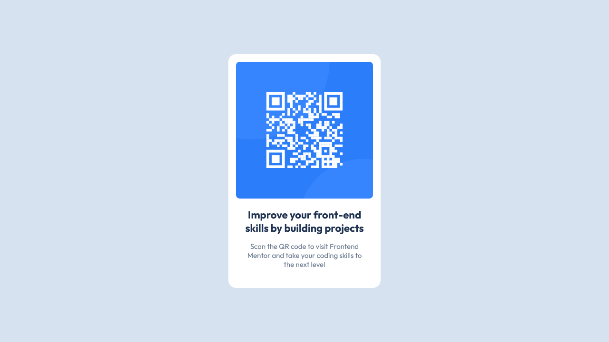

# Frontend Mentor - QR code component solution

This is a solution to the [QR code component challenge on Frontend Mentor](https://www.frontendmentor.io/challenges/qr-code-component-iux_sIO_H). Frontend Mentor challenges help you improve your coding skills by building realistic projects. 

## Table of contents

- [Overview](#overview)
  - [Screenshot](#screenshot)
  - [Links](#links)
- [My process](#my-process)
  - [Built with](#built-with)
  - [What I learned](#what-i-learned)
  - [Continued development](#continued-development)
  - [Useful resources](#useful-resources)
- [Author](#author)

## Overview

### Screenshot

### Links

- Solution URL: [qr-code solution](https://github.com/whawari/fm-qrcode)
- Live Site URL: [https://whawari.github.io/fm-qrcode/](https://whawari.github.io/fm-qrcode/)

## My process

### Built with

- Semantic HTML5 markup
- [Tailwind CSS](https://tailwindcss.com/) - Utility-first CSS framework

### What I learned

In this project I used Tailwind CSS for the first time throughout my development career.
I learned how to install and configure Tailwind CSS, add custom Google fonts, and use the necessary Tailwind CSS classes to match the design provided by Frontend Mentor.

### Continued development

I am currently learning Tailwind CSS, and I plan to continue refining my skills with it for future projects.

### Useful resources

- [Tailwind CSS Cheat Sheet](https://www.creative-tim.com/twcomponents/cheatsheet) - This helped me to quickly find Tailwind CSS classes needed for this challenge. I really liked the simplicity of the cheat sheet and will continue using it until I get a good grasp of Tailwind CSS classes.
- [Tailwind CSS documentation](https://tailwindcss.com/docs/installation) - I followed Tailwind CSS documentation to install and configure Tailwind CSS in this project.

## Author

- Frontend Mentor - [@whawari](https://www.frontendmentor.io/profile/whawari)
- Linkedin - [@walid-hawari](https://www.linkedin.com/in/walid-hawari/)
